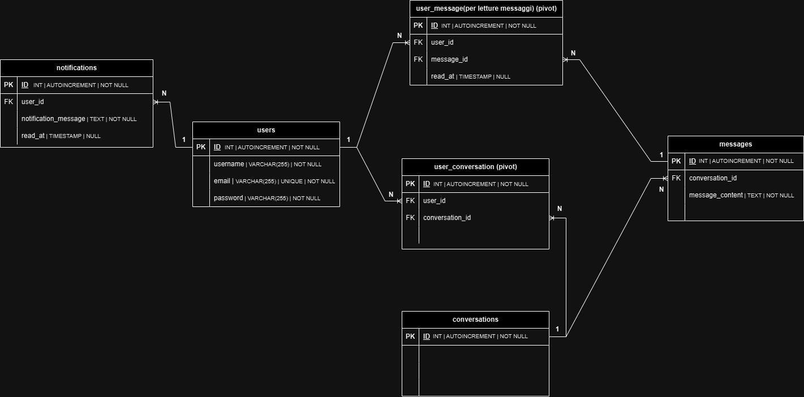

# LPChat

## Descrizione
Pensata come un “Minimum Viable Product”, è una web app di messaggistica in tempo reale con form di login, una dashboard dove vedere gli utenti registati e dove è possibile aprire una chat-room con loro. Nella dashboard è anche possibile vedere tramite notifica se ci sono messaggi ricevuti non ancora letti.


## Stack del progetto


## Features
<b>1. Autenticazione e gestione utenti</b>
- Login e registrazione utenti (registrazione, login, gestione sessioni). 
<br/><br/>

<b>2. Dashboard e chat-room</b><br/>
- Dashboard principale per visualizzare le chat-room con gli utenti.
- Badge di notifica accanto a ogni conversazione per mostrare quanti messaggi non letti ci sono.<br/><br/>

<b>3. Messaggistica e notifiche</b>
- Scambio di messaggi in tempo reale.
- Notifiche push in tempo reale che informano gli utenti quando arrivano nuovi messaggi.<br/><br/>

## Back-end
<b>1. Laravel:</b>
- Fornirà il backend dell'applicazione con le <b>API Resources</b> per utenti, conversazioni, notifiche e messaggi.
- Gestirà l'autenticazione degli utenti e la validazione dei dati.
- Si occuperà di archiviare i messaggi nel database.<br /><br />

<b>2. Pusher</b>
- Pusher si occuperà di propagare in tempo reale gli eventi relativi ai nuovi messaggi e alle notifiche, inviando gli aggiornamenti al front-end

## Front-end
<b>1. Vue</b>
- I componenti Vue saranno sviluppati con la sintassi <b>Composition API</b> e il progetto sarà configurato tramite <b>Vite</b> per lo scaffolding.<br /><br />

<b>2. Pinia</b>
- Pinia verrà utilizzato per gestire lo stato globale dell'applicazione. Ci sarà uno store che contiene i dati relativi ai messaggi, le notifiche e le conversazioni.
-	Verrà usato <b>Pinia Plugin PersistedState</b> per mantenere lo stato della chat anche dopo un aggiornamento della pagina, mantenendo i messaggi e le notifiche persistenti.<br /><br />

<b>3. Pusher:</b>
-	Pusher verrà configurato per ricevere gli eventi dal back-end (invio di un nuovo messaggio e notifiche in dashboard). Quando gli eventi saranno ricevuti, verrà aggiornato lo store di Pinia per mantenere i dati sincronizzati.
-	Quando Pinia aggiornerà lo stato, ciò aggiornerà automaticamente i componenti, senza dover ricaricare la pagina.<br /><br />

## Progettazione Database




## Stato attuale del progetto


- Tramite il comando `php artisan make:request` ho aggiunto la validazione per la login dell'utente
- Il database, tramite `Seeder`, è popolato con quattro utenti, due conversazioni e quattro messaggi.
- È possibile testare queste <b>API resources:</b><br /><br />


  <b>1. Risorsa: User</b>
    -	<b>GET | /api/users</b> - Restituisce l'elenco di tutti gli utenti registrati - <i>Metodo index()</i>
    -	<b>GET | /api/users/{id}</b> - Mostra i dettagli di un utente specifico - <i>Metodo show()</i><br /><br />
  
  <b>2. Risorsa: Conversation</b>
  -	<b>POST | /api/conversations</b> - Crea una nuova conversazione one-to-one - <i>Metodo store()</i>
  -	<b>GET | /api/conversations</b> - Restituisce i dettagli di tutte le conversazioni, inclusi i partecipanti e i messaggi - <i>Metodo index()</i>
  -	<b>GET | /api/conversations/{id}</b> - Restituisce i dettagli di una conversazione specifica, inclusi i partecipanti e i messaggi - <i>Metodo show()</i><br /><br />
  
  <b>3. Risorsa: Message</b>
  - <b>POST | /api/messages</b> - Crea un nuovo messaggio in una conversazione - <i>Metodo store() tramite <b>evento Pusher</b></i>
  - <b>GET | /api/messages/{conversationId}</b> - Restituisce tutti i messaggi di una conversazione - <i>Metodo index()</i>
  <br />
  <br />

  - Per fare il test delle API in locale tramite <b>Postman</b> è necessario <b>Postman Agent</b> e nel caso si verifichino problemi col certificato SSL bisogna aggiungere questo file al web server locale: [https://curl.se/ca/cacert.pem](https://curl.se/ca/cacert.pem)
  - <b>Esempio di test</b>: 
    - http://127.0.0.1:8000/api/conversations 
    - Metodo <b>POST</b>
    - Body > Raw > JSON > `{ "conversation_id": 1, "message_content": "Ciao, come va?", "user_ids": [1, 2] }` > <b>SEND</b> <br /><br /><br />


- L'evento di Pusher è configurato, ma al momento manca la ricezione sul front-end 

<br />

# Configurazione e inizializzazione
<br />


1. **Clona la repository e naviga nella cartella del progetto:**

   ```sh
   cd lpchat-back-end
   ```

2. **Installa le dipendenze:**

   ```sh
   composer install
   ```

3. **Avvia Migrazioni e Seeder**

   ```sh
   php artisan migrate
   php artisan db:seed
   ```

4. **Per avviare il progetto in modalità di sviluppo, esegui:**

   ```sh
   php artisan serve
   ```
   Questo comando avvierà il server di sviluppo e permetterà le chiamate API.